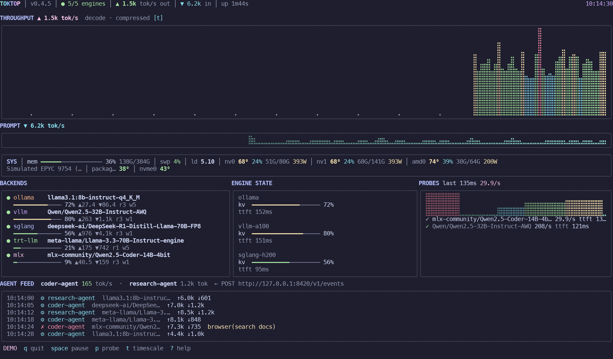

# toktop

`btop` for AI: a terminal dashboard for LLM inference engines and the agents
hammering them.

<p align="center">
  
</p>

```
toktop --demo            # simulated fleet, works instantly
toktop                   # auto-discovers local engines (ports + processes)
toktop --agents          # also watch the coding agents on this machine
toktop ssh://maci@box    # watch engines on another host
```

## Install

```
go install -tags sqlite github.com/maci0/toktop/cmd/toktop@latest
```

`-tags sqlite` matches the GitHub binaries and `make build`: crush and
opencode session databases cannot be read without it. Or download a binary
for linux/macos/windows (amd64 + arm64) from the
[releases](https://github.com/maci0/toktop/releases). An installed binary
updates itself in place:

```
toktop update --check    # report the latest release, change nothing
toktop update            # download it and replace the running binary
```


## AI coding agents

toktop also watches the coding agents running on this machine, not just
inference engines. It finds them by process, reads the token counts they
already write to their own session logs, and shows their throughput beside the
engines:

```
AGENTS  local, read from their own session logs
  claude   ▲ 1.1k tok/s   ↓2.4k ↑8.1k   ● live
  codex    ▲ 340 tok/s    ↓18k ↑40k     via 127.0.0.1:11434  ● live
```

`--agents` turns this on. It is off by default because it means scanning this
machine's processes and reading session files nobody pointed toktop at:
watching engines you configured does not imply consent to that.

With no engines attached, agents mode is the full dashboard: header rates,
throughput charts and the host strip, all driven from the session logs.
Prompt, output and (when the agent reports it) reasoning tokens are shown
per agent. An agent generating through an engine toktop is already measuring
still appears in the list, labelled `via <engine>`, but those tokens are not
added on top of the engine's own numbers.

Once asked for, nothing else has to be configured and the agent does not have
to cooperate: claude, codex, qwen, copilot, pi, prime-agent, feynman, clanker,
and dsh all keep transcripts that carry the provider's own counts. Agents that
report nothing show no rate rather than a zero.

Two agents keep databases instead of transcripts, and both need the `sqlite`
build tag, which decides whether a driver is compiled in at all (released
binaries and `make build` carry it; `make build TAGS=` leaves it out).

opencode keeps one session store for the whole machine, so it is gated twice:
the tag links the driver, and `--opencode-db` decides whether a binary that has
it opens the operator's database. Asking for it in a build without the driver
says so on stderr rather than reporting a silent zero.

crush keeps its database inside the project it is working on
(`.crush/crush.db`, at the project root it resolves), with the counts in
`sessions.completion_tokens`. That is the same file a review is already
reading and writing, so there is no second gate: with the tag, it is read. The
only JSONL crush writes is its log, which carries no counters.

Reading is done by this repo's own `agentusage` package, which gauntlet also
imports, so both tools report the same numbers. Agents defined in
`~/.gauntlet/agents.json` are picked up here too; a malformed file is reported
at startup rather than silently shrinking the watch to the built-in agents.
Set `GAUNTLET_HOME` to read that file from somewhere else.

## What it shows

- **Backends** - every engine found locally or via ssh, with model, version,
  KV-cache pressure, queue depth and throughput. Fingerprinted kinds:
  Ollama, llama.cpp/llamafile/ramalama, vLLM, SGLang, TRT-LLM/Triton,
  LM Studio, MLX (mlx-lm / LM Studio), KoboldCpp, LocalAI, TGI, LiteLLM,
  GPUStack, Lemonade, OmniRoute (auto-detected via its routing header;
  per-model context windows shown) - plus a generic OpenAI-compatible
  fallback so nothing is left out (text-generation-webui and TabbyAPI are
  discovered by process/port but identified as generic OpenAI).
- **Throughput charts** - aggregate decode + prompt tokens/sec as heat-colored
  area charts; engine-published tok/s gauges are trusted when present.
  Agents with no local engine (or whose engine is not monitored) add their
  own rates; tokens already counted by a watched engine are not added again.
- **Probes** (`p`, `--probe N`) - tiny streaming generations measuring real
  TTFT and decode speed per backend.
- **Agent feed** - any harness can POST usage events:
  ```
  curl -X POST localhost:8420/v1/events -d \
    '{"agent":"coder","kind":"tool","prompt_tokens":4200,"output_tokens":310,"thinking_tokens":40,"note":"shell(git status)"}'
  ```
  `--agents` also fills this from local session logs. Per-agent rows show
  output, prompt and reasoning rates; an agent using a monitored engine is
  labelled `via` that engine so its tokens are not added twice.
- **System strip** - RAM/swap/load, CPU model, OS+kernel, GPU driver versions
  (incl. CUDA), NPU enumeration (Intel NPU, AMD XDNA xN, Qualcomm Cloud
  AI100, Apple Neural Engine with chip generation), GPU temp/util/VRAM/
  power - on Apple Silicon including live wired-memory and
  utilization from IOAccelerator - and a second identity row for sensors.
- **Braille charts** - dot-matrix rendering with btop-style fading bloom;
  timescale compresses leftward (`t` toggles) with faint grid marks showing
  where each doubling begins.
- **Hot reload** - rebuild the binary while it runs and toktop restarts
  into the fresh build automatically (`--no-hot-reload` to disable).

## Agent feed API

The ingest server runs by default on `127.0.0.1:8420` (`--ingest ADDR` to
move it, `--no-ingest` to turn it off) and speaks plain HTTP/JSON:

| endpoint | purpose |
|---|---|
| `POST /v1/events` | record events; body is one JSON object or an NDJSON stream |
| `GET /v1/events` | schema hint for humans |
| `GET /healthz` | liveness probe, answers `ok` |

Event fields are all optional; anything omitted gets the default:

| field | type | default | notes |
|---|---|---|---|
| `id` | string | - | caller-chosen key, capped at 128 runes; a repeat of a key still in the retained feed (last 64 events) is ignored |
| `ts` | RFC 3339 string | arrival instant | offset-less stamps decode as UTC |
| `agent` | string | `anonymous` | capped at 64 runes |
| `model` | string | - | capped at 128 runes |
| `kind` | string | `turn` | known kinds: `turn`, `tool`, `error`, `note`; custom kinds pass through lowercased, capped at 24 runes |
| `prompt_tokens` / `output_tokens` / `thinking_tokens` | integer | `0` | negative values clamp to `0`; thinking is the reasoning share of output when the agent says so |
| `note` | string | - | free-form, capped at 512 runes |

One POST answers `202` with `{"accepted":N}` once every event in the stream
is recorded, `400` for malformed JSON or a bad `ts`, `408` when a stream
stalls mid-body, and `413` past the 1 MiB body cap. A POST carrying an
`Origin` header (browser-driven; scripts and agents never send one) is
refused with `403`, so a web page cannot forge rows into a running
dashboard. Error bodies are short
plain-text reasons; unknown fields are ignored, so harnesses can include
their own. The request `Content-Type` header is not checked: the body is
always read as JSON/NDJSON, so plain `curl -d` works unmodified.
Every POST is logged to stderr as one structured line (`req`, `status`,
`accepted`, `duration`, `remote`; failures add `error`). Event bodies are
not logged. Responses carry `X-Request-Id`, echoed from the request when
the sender set one.

Streams are recorded line by line: if a later line fails, events before it
stay recorded and the error states how many. Retrying a stream (or a
successful POST whose 202 was lost) is safe when each event carries a stable
`id`; without one, replaying the kept lines would duplicate them.

## Zero vendor libraries

Everything comes from procfs/sysfs/sysctl, vendor CLIs it shells out to
(`nvidia-smi`, `rocm-smi`, `xpu-smi`, `system_profiler`, `ioreg` - each the
vendor's documented interface with no in-process alternative) or plain HTTP
from the engines themselves. SSH transport is an embedded pure-Go client, so
remote monitoring needs no ssh binary either. No NVML, no Level Zero, no
cgo: single static binary, trivially cross-compiled.

Linux reads `/proc` + `/sys`; macOS uses sysctls and `system_profiler`;
Windows uses `GlobalMemoryStatusEx`, `RtlGetVersion` and one CIM query for
process command lines.

## Engines: how discovery works

1. Running **processes** matching well-known names (`ollama`, `llama-server`,
   `vllm`, `sglang`, `koboldcpp`, `lm studio`, `lemonade-server`, ...) give
   candidate URLs, honouring `--port` flags.
2. A scan of well-known ports follows (11434, 30000, 8000, 13305, 8080,
   1234, 5001, 5000, 4000, 1337, 4891, 7860, ...).
3. Each candidate is fingerprinted by its HTTP surface; anything unrecognized
   that still speaks OpenAI is shown as such.

Attach anything explicitly:

```
toktop --add http://10.0.0.5:8000        # repeatable
toktop ssh://user@host                   # remote engines + host vitals
```

SSH mode is built in (pure Go, no ssh binary needed) and the remote only
needs a POSIX shell - no agent is installed. Discovery reads the remote
`/proc` directly: listening sockets from `/proc/net/tcp(+6)` (with an active
port probe as fallback) plus engine processes with their `--port` flags, so
engines on custom ports are found just like locally. Engine traffic rides
ssh direct-tcpip channels on that same connection. Each remote engine port is
reached through a loopback listener bound to `127.0.0.1` with an ephemeral
port, so local clients attach the same way they would to a local engine;
those listeners are reachable by any process on this host. Host vitals
stream the same way: load, memory, uptime, CPU model, OS, kernel and GPU
rows (`nvidia-smi`, or `rocm-smi` on AMD boxes).

Auth tries, in order: `--ssh-key PATH`, keys from `~/.ssh/config`
(`HostName`, `User`, `Port`, `IdentityFile` are honored), your default
keys, ssh-agent, and finally a password prompt when stdin is a terminal
(or set `TOKTOP_SSH_PASSWORD` for headless runs). Host keys use
trust-on-first-use, stored under your config dir; a changed key is refused
loudly.

## Keys

| key | action |
|---|---|
| `q` | quit |
| `esc` | close help / quit |
| `space` | pause streaming |
| `p` | fire probes at every backend |
| `t` | toggle compressed timescale + grid |
| `?` | help |

## Accessibility

toktop is usable without a mouse, without color vision, and with assistive
technology:

- **Keyboard only** - every action has a key (table above); nothing requires
  pointing or clicking, and `?` always shows the full key map.
- **Pause freezes everything** - `space` stops the streaming data and the
  header clock, so a still frame can be read at leisure with a screen reader
  or magnifier.
- **Status never rides on color alone** - down engines show `✗` plus their
  error text, probes show `✓`/`✗`, gauges print their percentage, and the
  engine count is spelled out numerically in the header.
- **Non-visual output** - `--once` prints one static frame instead of running
  the full-screen UI; a live-repainting dashboard defeats most screen readers,
  so the static frame is the intended path. Pair it with
  `TOKTOP_COLUMNS` / `TOKTOP_LINES` for a fixed size. `--once --plain` goes
  further and prints the same numbers as a linear text report: no braille
  chart glyphs (which screen readers announce as endless dot-pattern noise or
  skip entirely), no box-drawing borders, no multi-column panels - just the
  data in reading order.

  ```
  $ toktop --once --plain
  5/5 engines up · out 979 tok/s · in 4.1k tok/s · session 24s

  ENGINES
  up   vllm-a100 (vllm)
         Qwen/Qwen2.5-32B-Instruct-AWQ
         out 155 tok/s · in 662 tok/s · kv cache 68% · running 2 · waiting 0 · ttft 115ms

  SYSTEM
  memory 64% (247G/384G) · swap 17% · load 5.06
  gpu nv0 A100-SXM4-80GB 82° 69% util vram 57G/80G 397W

  PROBES
  ok llama3.1:8b-instruct-q4_K_M ttft 83ms 26.8 tok/s

  AGENT FEED
  ops-agent 487 tok/s · swarm-07 392 tok/s
  10:16:15 error swarm-07 model deepseek-ai/DeepSeek-R1 prompt 1.5k output 242 note retry after 429
  ```

- **Tested contrast** - unit tests hold the palette to WCAG 2.2 AA: text
  colors at >= 4.5:1 on the background, and chart marks at >= 3:1 even at
  the deepest point of the age fade (`internal/ui/theme_test.go`).
- **No color** - `NO_COLOR` strips styling as usual; layout and text carry
  the same information without it.

## Flags

```
toktop update     subcommand: install the latest release (--check to only
                  report it, --repo owner/name for a fork)
--demo            simulated fleet, zero setup
--add URL         attach an openai-compatible endpoint (repeatable)
ssh://user@host   positional; monitor remote hosts (repeatable)
--ssh-key PATH    private key for ssh targets (overrides ~/.ssh/config)
--bearer TOKEN    bearer token sent to --add endpoints only; OmniRoute API
                  keys etc. (env: OMNIROUTE_API_KEY, then TOKTOP_BEARER)
--agents          watch AI coding agents on this machine (session logs)
--opencode-db     with --agents: also read opencode's SQLite session
                  database (needs a build with the sqlite tag)
--probe N         auto-probe every N seconds
--interval D      poll interval (default 1s)
--ingest ADDR     agent event listen address (default 127.0.0.1:8420)
--no-ingest       disable the event endpoint
--once            render one frame and exit
--plain           with --once: linear text report instead of the dashboard
                  frame (screen-reader friendly)
--frames N        with --once: snapshots to accumulate before rendering
--seed N          demo RNG seed
--no-hot-reload   disable restart-on-rebuild while running
--version         print version and exit
--help, -h        show usage, examples and environment fallbacks
```

Password auth for ssh targets: interactive prompt, or `TOKTOP_SSH_PASSWORD`.

## Environment variables

| variable | what it does |
|---|---|
| `OMNIROUTE_API_KEY` | bearer token fallback for `--bearer` (checked first) |
| `TOKTOP_BEARER` | bearer token fallback for `--bearer` (checked after `OMNIROUTE_API_KEY`) |
| `TOKTOP_SSH_PASSWORD` | ssh password for headless runs; otherwise an interactive prompt |
| `TOKTOP_COLUMNS` / `TOKTOP_LINES` | fixed frame size for `--once` output (screenshots, capture); must be > 40 / > 20, and a set-but-invalid value aborts with exit code 2 |
| `GITHUB_TOKEN` | optional; authenticates `toktop update`'s GitHub API calls past the anonymous rate limit |
| `GAUNTLET_HOME` | directory holding `agents.json` (default `~/.gauntlet`) |

The flag always wins over its env fallback. Prefer an env var over
`--bearer` for tokens: command-line arguments are visible in process
listings to every user on the host. The token travels only to endpoints
named with `--add`; engines found by port scanning receive no credentials,
so a hostile listener on a probed port cannot collect your gateway key.
An endpoint that needs the key must be attached explicitly, e.g.
`toktop --add http://127.0.0.1:20128`. Unknown `TOKTOP_*` variables are
reported at startup, so a typo fails loudly instead of doing nothing.
Out-of-range flag values (`--interval 0`, negative `--probe`, `--frames < 1`
with `--once`) abort with exit code 2 instead of being silently adjusted;
so do out-of-range `TOKTOP_COLUMNS` / `TOKTOP_LINES` when `--once` renders.

## Build & test

```
make help                          # every task, one line each
make build                         # host binary, version-stamped
make demo                          # build, then run the simulated fleet
make test                          # all tests, -race -shuffle=on
make ci                            # exactly what CI gates on before merging
go test ./internal/ui              # one package while iterating
go test ./internal/core -run TestSanitizeTextPreservesUTF8   # one test
```

Cross-compiles (no cgo anywhere):

```
GOOS=darwin GOARCH=arm64 go build -o toktop-macos ./cmd/toktop
GOOS=windows GOARCH=amd64 go build -o toktop.exe ./cmd/toktop
```

See [CONTRIBUTING.md](CONTRIBUTING.md) for prerequisites, the edit-test loop,
and what CI runs, and [docs/THREAT_MODEL.md](docs/THREAT_MODEL.md) for the
attack surface, what toktop trusts, and the mitigations already in place.

Releases: push a tag `v*` and GitHub Actions attaches binaries for
linux/amd64, linux/arm64, darwin/amd64, darwin/arm64, windows/amd64, plus a
CycloneDX SBOM of every dependency (`make sbom`). Versions are 0.x: the CLI,
the ingest `/v1/events` body, and the `agentusage` Go API may change without a
major bump. Consumer-facing notes live in [CHANGELOG.md](CHANGELOG.md). CI
runs `govulncheck` on every push; Dependabot keeps go modules and workflow
actions current.
